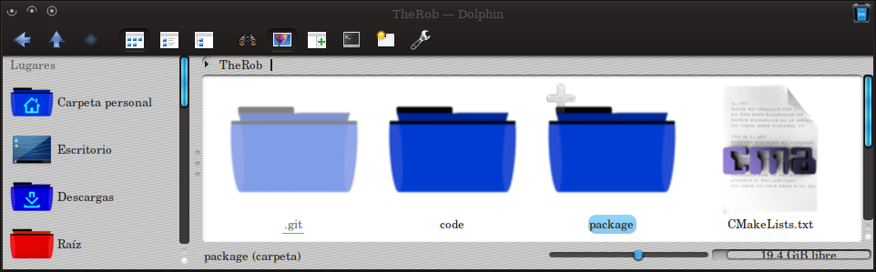

TheRob building from source
====================
TheRob KDE window decoration 




### Installation


##### Building from source

```
mkdir build
cd build
cmake -DCMAKE_INSTALL_PREFIX=/usr ..
make
sudo make install
```
